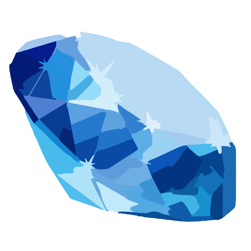

# Sapphire

 

 

Sapphire is a Flexible and efficient Deep learning framework built for research purpose.

## Aim of this project
* Efficient Sparse-Sparse, Dense-Dense matrix operations on CPU and GPU
* Designed and optimized for x86-64 processors with AVX instructions and Nvidia GPUs supporting CUDA
* Support for deep-learning operations
* Supports flexible modeling and custom operations
* Intuitive and easy to use interface with C++17 support

## Documents
Refer to this notion page
https://witty-print-3f0.notion.site/Supported-Layers-97317b7921664aabb25a2d231674990e

## Contact

You can contact me via e-mail (jwkimrhkgkr@gmail.com or jwkim98@kaist.ac.kr).
I am always happy to answer questions or help with any issues you might have, and please be sure to share any additional work or your creations with me, I love seeing what other people are making.

## License

The class is licensed under the [MIT License](http://opensource.org/licenses/MIT):

Copyright &copy; 2020[Justin Kim](http://www.github.com/jwkim98).

Permission is hereby granted, free of charge, to any person obtaining a copy of this software and associated documentation files (the "Software"), to deal in the Software without restriction, including without limitation the rights to use, copy, modify, merge, publish, distribute, sublicense, and/or sell copies of the Software, and to permit persons to whom the Software is furnished to do so, subject to the following conditions:

The above copyright notice and this permission notice shall be included in all copies or substantial portions of the Software.

THE SOFTWARE IS PROVIDED "AS IS", WITHOUT WARRANTY OF ANY KIND, EXPRESS OR IMPLIED, INCLUDING BUT NOT LIMITED TO THE WARRANTIES OF MERCHANTABILITY, FITNESS FOR A PARTICULAR PURPOSE AND NONINFRINGEMENT. IN NO EVENT SHALL THE AUTHORS OR COPYRIGHT HOLDERS BE LIABLE FOR ANY CLAIM, DAMAGES OR OTHER LIABILITY, WHETHER IN AN ACTION OF CONTRACT, TORT OR OTHERWISE, ARISING FROM, OUT OF OR IN CONNECTION WITH THE SOFTWARE OR THE USE OR OTHER DEALINGS IN THE SOFTWARE.
